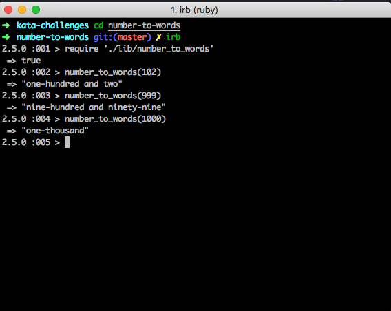

## Number to Words

A Simple Kata challenge to convert numbers from 0- 1000 into it's corresponding words
Built for CLI interface using Ruby and RSPEC for tests.

## Launch and Test
  clone repo
  `git clone https://github.com/dct-lau17/number-to-words-ruby.git`

  Open terminal navigate to directory and run code on irb
  ```
  cd number_to_words
  irb
  ```
  Require the file
  `require ''./lib/number-to-words'`

  run `rspec` in file directory to see tests

### Commands
```
number_to_words(100)
=> one-hundred

number_to_words(999)
=> nine-hundred and ninety-nine
```

### Example


